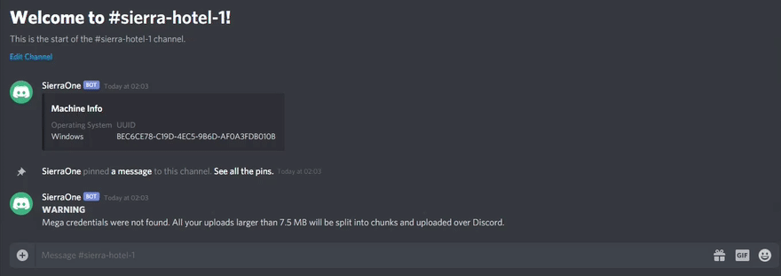

# SierraOne

`SierraOne` is a simple shared reverse shell over Discord, based on [SierraTwo](https://github.com/berkgoksel/SierraTwo) which works over Slack. The idea is to have a shell everyone can play around with during a CTF. Also, we like using Discord as [@ExploitStudio][ExploitStudio].



## Usage
`SierraOne` only supports Python 3.x.

### Direct Usage
#### Windows
Not available. Instead, refer to [building](#building) to build an `.exe` for Windows.

#### Linux
```
$ sudo apt install python3-pip
$ pip3 install -r requirements.txt
$ python3 SierraOne.py
```

### Building
To build an executable:

```
$ sudo apt install python3-pip winbind wine winetricks
$ wget https://www.python.org/ftp/python/3.8.2/python-3.8.2-amd64.exe
$ wine python-3.8.2-amd64.exe
$ pip3 install -r requirements.txt
$ wine pip install -r wine_requirements.txt
$ python3 builder.py -o <TARGET SYSTEM>
```

#### **BE SURE TO ADD PYTHON TO PATH WHEN INSTALLING WITH WINE**

The following commands will setup Wine with 64 bit Python 3.8.2 on your system. `<TARGET SYSTEM>` can be either 
`Windows` or `Linux`. After building the executable, check the `dist` folder for your exectuable.

For example, running `python3 builder.py -o Linux` on a 64 bit Linux will generate a 64 bit executable. Same logic 
applies for `-o Windows`. If you want to generate a 32 bit executable, you'd have to install 32 bit Python instead of 
64 bit (on your Linux and/or Wine).

If built for Windows:
- The executable's name will be `msdtc.exe`
- Executable will automatically minimize and hide itself

If built for Linux:
- The executable's name will by `system`.

## Configuration
To use `SierraOne`, create a new server or be a part of a Discord server where you are an admin. Afterwards go to 
[Discord Developer Portal][Discord Developer Portal] and create a new application. In your application's settings, go 
to the `Bot` tab and turn your application into a bot. Then, go to the `OAuth` tab and tick `Bot` in `Scopes` and 
`Administrator` in `Bot Permissions`. Then, use the generated link to add the bot to your server.

Finally, copy `Token` in `Bot` tab of [Discord Developer Portal][Discord Developer Portal] and copy `Server ID` from 
`Widget` tab found on your Discord server's settings and paste the said info to their corresponding places `config.py`.


Optionally, you can integrate [Mega][Mega] in `config.py`, where the `SierraOne` will upload files larger than 7.5 MB 
and up to 105 MB to your Mega account. Otherwise, files larger than 7.5 MB and up to 30 MB will be split into 7.5 MB 
parts and uploaded over Discord.

## Notes

- Although `SierraOne` could be used for pentesting, it's highly discouraged to do so. This is because Discord keeps 
records of all chat history, which might lead to disclosure of confidential data. It is recommended to pack/crypt the 
binaries before use. 
- The traffic flows through Discord (and optionally, Mega Upload) therefore generating IoC's and rules for Sierra should be harder than your regular reverse shell. 
- Upon launch, `SierraOne` will connect to the Mega (if the credentials are present) then connect to Discord. Upon 
connecting to Discord, it'll check the server for a category matching the category prefix. If there are no categories 
matching the prefix, a category matching the prefix will be created. By default, this is `SierraOne`. Afterwards; in a 
similar fashion, `SierraOne` will look for channels matching the channel prefix. If there are no channels matching the 
prefix, `prefix-1` will be created. By default, this is `sierra-hotel-1`. However, if there is a channel (or channels) 
matching the prefix, `SierraOne` will get the largest number amongst the matching channels and add onto the largest 
number amongst the channels. That means if `sierra-hotel-5` is the with the largest number amongst all present 
channels, the next channel will be `sierra-hotel-6`.
- You can only run one instance of `SierraOne` at a given time. This is due to Discord's API. To circumvent this, you 
can create multiple applications in [Discord Developer Portal][Discord Developer Portal] and run multiple instances of 
`SierraOne` under different, unique tokens.
- To close your shell, type `shell_exit` in the channel. 
- To close your shell and delete the channel, type `shell_delete` in the channel.
- Although `SierraOne` could be used for pentesting, it's highly discouraged to do so. This is because Discord keeps 
records of all chat history, which might lead to disclosure of confidential data. It's recommended to pack/crypt the 
binaries before use. 
- The channels will be created under the predetermined prefix. You can change this prefix in `config.py`

## Known Bugs
- When uploading with Mega, if the upload takes a while, it's possible that the current shell will be closed and a new 
shell will be made. `SierraOne` will stop responding in the old channel, but continue to respond in the new channel.


## Disclaimers
- This project is for educational purposes only. The developers and contributors are not responsible for any damage 
that may be caused by this program nor any consequences that may arise.
- By using this program you accept that the developers and contributors are not responsible if you violate 
[Discord's Terms of Service][Discord ToS], [Discord's API Terms of Service][Discord API ToS] and [Mega Upload's ToS][Mega ToS].
- With the current permissions of the app, `SierraOne` will have an admin access over your workspace.


## Acknowledgements:
- Special thanks to [Arszilla][Arszilla] for helping out with the development and testing.

[SierraTwo]:                https://github.com/berkgoksel/SierraTwo
[ExploitStudio]:           https://exploit.studio/
[Discord Developer Portal]: https://discordapp.com/developers/applications
[Mega]:                     https://mega.nz
[Discord ToS]:              https://discordapp.com/terms
[Discord API ToS]:          https://discordapp.com/developers/docs/legal
[Mega ToS]:                 https://mega.nz/terms
[Arszilla]:                 https://twitter.com/Arszilla
